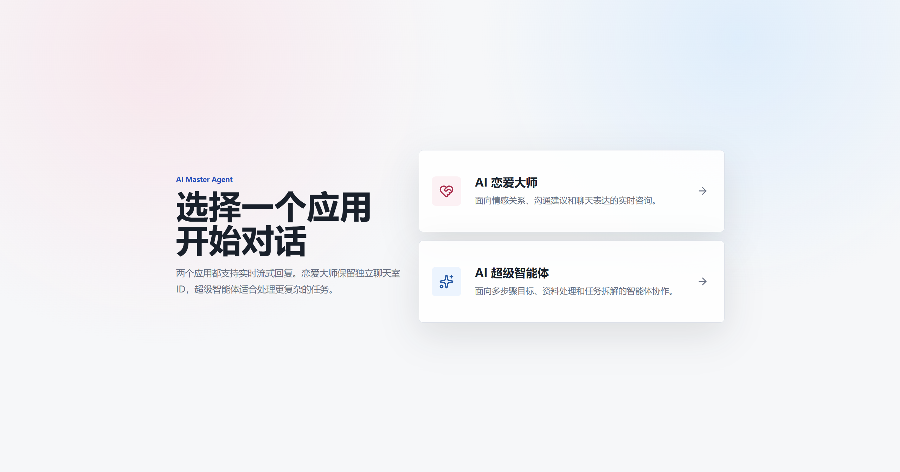

# AI Love Master Agent

AI Love Master Agent 是一个面向恋爱、关系沟通与约会规划场景的智能体应用。项目由 Spring Boot 后端、Vue 3 前端和图片搜索 MCP Server 组成，后端基于 Spring AI / Spring AI Alibaba 接入通义千问、RAG、工具调用和多步智能体编排能力。

## 网站首页



## 功能特性

- 恋爱问答：基于本地 Markdown 知识库提供关系建议与沟通建议。
- 流式对话：通过 SSE 实时返回模型生成内容。
- Manus 智能体：支持任务拆解、工具调用、结果校验和修复策略。
- RAG 检索增强：支持文档加载、文本切分、关键词增强、查询改写和向量检索。
- 工具能力：内置网页搜索、网页抓取、文件操作、资源下载、终端操作、PDF 生成等工具。
- MCP 集成：通过 Spring AI MCP Client 接入高德地图 MCP 和本地图片搜索 MCP Server。
- 前端界面：Vue 3 + Vite 实现首页、恋爱助手对话和 Manus 对话页面。
- 自动化测试：覆盖 Controller、Agent、RAG、工具、策略、运行时和领域技能等核心模块。

## 技术栈

| 模块 | 技术 |
| --- | --- |
| 后端 | Java 21、Spring Boot 3.5.14、Spring AI 1.1.2、Spring AI Alibaba 1.1.2.3 |
| 模型服务 | DashScope / 通义千问 |
| 数据与检索 | PostgreSQL、pgvector、Spring AI Vector Store |
| 工具与集成 | MCP Client、OkHttp、Jsoup、iText、Knife4j |
| 前端 | Vue 3、Vue Router、Vite、Axios、Lucide Vue |
| MCP Server | Spring Boot 4.1.0、Spring AI MCP Server WebMVC |
| 构建工具 | Maven Wrapper、npm |

## 项目结构

```text
.
├── src/                                  # 后端主应用
│   ├── main/java/com/bvz/aiagent
│   │   ├── agent/                        # Agent 基类、ReAct、LoveManus
│   │   ├── app/                          # LoveApp 对话应用
│   │   ├── controller/                   # HTTP / SSE 接口
│   │   ├── core/                         # 智能体核心模型、运行时、策略、契约、工具解释器
│   │   ├── domain/love/skills/           # 恋爱场景技能
│   │   ├── rag/                          # RAG 文档加载、切分、改写、向量存储配置
│   │   └── tools/                        # 工具实现与注册
│   ├── main/resources
│   │   ├── document/                     # 恋爱场景知识库 Markdown 文档
│   │   ├── application.yml               # 通用配置
│   │   ├── application-local.yml         # 本地配置
│   │   └── mcp-servers.json              # MCP Client stdio 服务配置
│   └── test/                             # 后端测试
├── love-master-agent-frontend/           # Vue 3 前端
├── image-search-mcp-server/              # 图片搜索 MCP Server
├── docs/images/                          # README 与文档图片资源
├── specs/                                # 需求与重构规格文档
├── AGENT.md                              # 智能体行为说明
└── constitution.md                       # 项目约束与原则
```

## 环境要求

- JDK 21+
- Maven 3.9+，或直接使用项目自带的 `mvnw` / `mvnw.cmd`
- Node.js 20+ 与 npm
- PostgreSQL + pgvector
- DashScope API Key
- 可选：高德地图 API Key、Pexels API Key、搜索 API Key

## 配置说明

后端默认读取 `local` profile：

```yaml
spring:
  profiles:
    active: local
server:
  port: 8123
  servlet:
    context-path: /api
```

请在本地配置中准备以下关键配置。建议使用环境变量、未提交的本地配置文件或启动参数管理密钥，避免将真实密钥提交到仓库。

```yaml
spring:
  ai:
    dashscope:
      api-key: ${DASHSCOPE_API_KEY}
      chat:
        options:
          model: qwen-plus
      embedding:
        options:
          model: text-embedding-v1
  datasource:
    url: jdbc:postgresql://localhost:5432/postgres
    username: ${POSTGRES_USERNAME}
    password: ${POSTGRES_PASSWORD}

dashscope:
  api-key: ${DASHSCOPE_API_KEY}

search-api:
  api-key: ${SEARCH_API_KEY}
```

前端默认请求后端地址为：

```text
http://localhost:8123/api
```

如需修改，在 `love-master-agent-frontend/.env.local` 中配置：

```env
VITE_API_BASE_URL=http://localhost:8123/api
```

## 快速启动

### 1. 构建图片搜索 MCP Server

主应用的 `mcp-servers.json` 会以 stdio 方式启动 `image-search-mcp-server/target/image-search-mcp-server-0.0.1-SNAPSHOT.jar`，因此首次启动主应用前需要先构建该模块。

Windows:

```powershell
cd image-search-mcp-server
.\mvnw.cmd clean package
```

macOS / Linux:

```bash
cd image-search-mcp-server
./mvnw clean package
```

### 2. 启动后端

Windows:

```powershell
.\mvnw.cmd spring-boot:run
```

macOS / Linux:

```bash
./mvnw spring-boot:run
```

后端默认地址：

```text
http://localhost:8123/api
```

接口文档：

```text
http://localhost:8123/api/swagger-ui.html
```

> 注意：当前 `HealthController` 类上配置了 `/api/health`，同时应用全局上下文路径为 `/api`，因此健康检查实际路径是 `http://localhost:8123/api/api/health`。

### 3. 启动前端

```bash
cd love-master-agent-frontend
npm install
npm run dev
```

Vite 会输出本地访问地址，通常为：

```text
http://localhost:5173
```

## 常用接口

| 方法 | 路径 | 说明 |
| --- | --- | --- |
| GET | `/api/ai/love_app/chat/sync?message=你好&chatId=demo` | LoveApp 同步对话 |
| GET | `/api/ai/love_app/chat/sse?message=你好&chatId=demo` | LoveApp SSE 流式对话 |
| GET | `/api/ai/manus/chat?message=帮我规划约会` | LoveManus SSE 流式智能体对话 |
| GET | `/api/api/health` | 健康检查 |

## 测试

运行全部后端测试：

```bash
./mvnw test
```

Windows:

```powershell
.\mvnw.cmd test
```

运行前端生产构建：

```bash
cd love-master-agent-frontend
npm run build
```

构建图片搜索 MCP Server：

```bash
cd image-search-mcp-server
./mvnw clean package
```

## MCP Server

主应用通过 `src/main/resources/mcp-servers.json` 配置 stdio MCP 服务：

- `amap-maps`：通过 `npx @amap/amap-maps-mcp-server` 启动高德地图 MCP。
- `image-search-mcp-server`：通过 Java jar 启动本地图片搜索 MCP Server。

图片搜索 MCP Server 默认配置：

```yaml
spring:
  application:
    name: image-search-mcp-server
  profiles:
    active: stdio, local
server:
  port: 8127
```

stdio 模式下会关闭 Web 应用类型，并通过标准输入输出与 MCP Client 通信。

## 开发约定

- 不要提交真实 API Key、数据库密码或第三方服务凭据。
- 修改智能体行为时，优先补充或更新 `core`、`agent`、`domain/love/skills` 相关测试。
- 修改前后端接口时，同步更新前端 `src/api` 调用和 README 接口说明。
- RAG 知识库文档位于 `src/main/resources/document`，新增文档后需要确认加载、切分和检索效果。

## 许可证

当前项目尚未声明许可证。如需开源或分发，请先补充明确的 LICENSE 文件。
